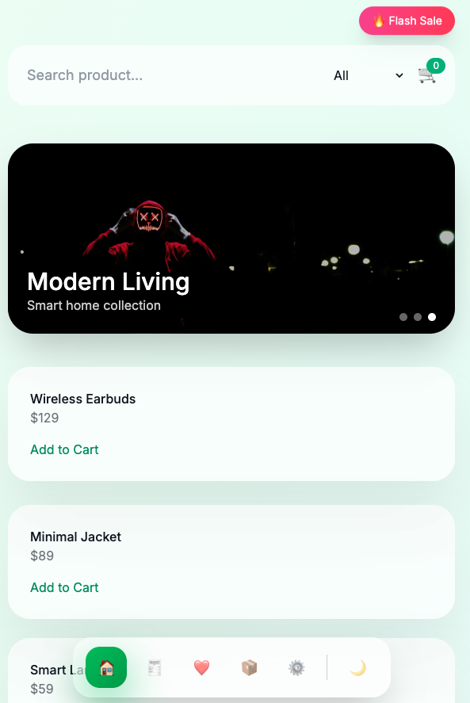
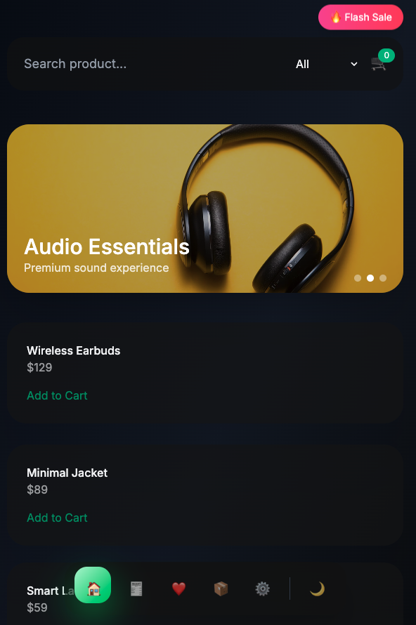
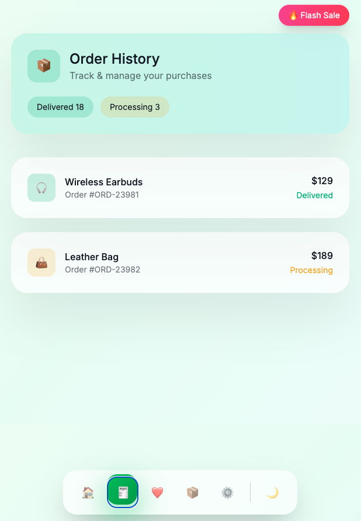
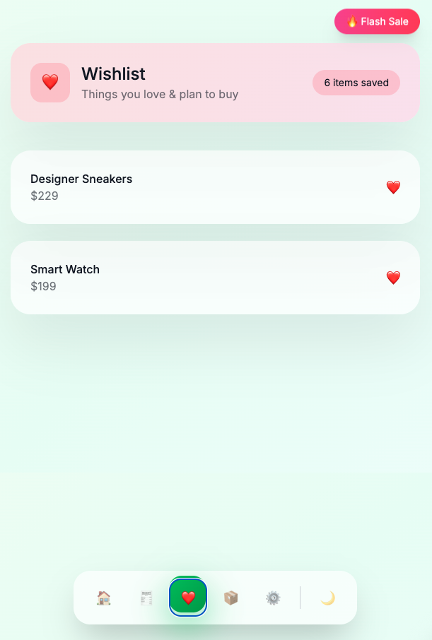
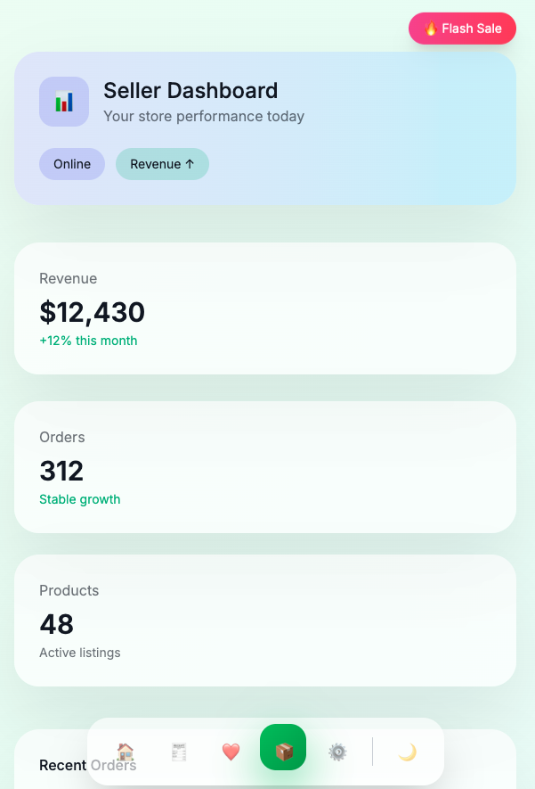
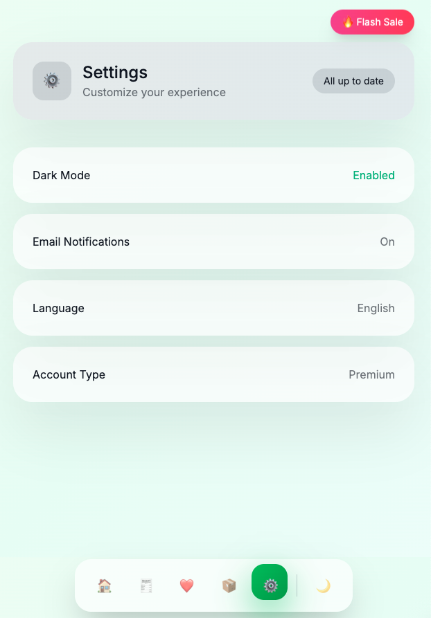

# ❄️ Crystal Commerce UI — Premium Web E-Commerce Demo

A **cinematic, glassmorphism-based e-commerce web UI** built with **HTML + Tailwind CSS + Vanilla JavaScript**, designed to feel like a **real funded startup product**, not just a static mockup.

This project focuses on **premium interaction, micro-animation, and mobile-first UX**, inspired by modern platforms such as **Apple, Shopify, Tokopedia, and Stripe** — with a unique **crystal / frost visual signature**.

---

## ✨ Key Highlights

### 🧊 Signature Crystal / Frost Experience
- Glassmorphism + blur layers
- Crystal / frost distortion overlays
- Frost crack & light refraction effect
- Subtle “luxury cold” visual identity

### 🎬 Cinematic Motion System
- Page fade-up entrance animation
- Smooth page transitions
- Animated sliding pill navigation indicator
- Soft hover & press micro-interactions
- Add-to-cart flying animation (position-accurate)

### 🌗 Dark ↔ Light Mode
- Smooth theme transition
- System-like toggle
- Persisted via `localStorage`

---

## 🧭 App Structure

The UI simulates a **real e-commerce application** with multiple pages and states:

### 🏠 Home
- Parallax hero slider with promo banners
- Floating promo badge
- Search bar & product filter
- Product grid (Tokopedia-style layout)
- AI recommendation banner (visual simulation)
- Add to cart animation
- Cart icon near filter area (UX optimized)

### 🧾 Order History
- Premium header with statistics
- Delivered / Processing state
- Empty & edge state support
- Clean transaction list UI

### ❤️ Wishlist
- Wishlist list layout
- Empty state UX
- Future-ready structure for product cards

### 📦 Seller Dashboard
- Seller analytics cards
- Revenue / Orders / Products overview
- Designed for scalability (charts & tables ready)

### ⚙️ Settings
- Polished settings rows
- Large tap targets (mobile-safe)
- System-like interaction feel

---

## 📱 Mobile-First UX (Audited)

- Bottom navigation centered on mobile
- Safe tap targets (≥ 44px)
- Bottom padding safe-area aware
- Slide & swipe-ready slider
- Responsive spacing across breakpoints
- Accurate animation target on all screen sizes

---

## 🧠 UX & Product Details

✔ Global header system for consistency  
✔ Empty & edge state design (no dead screens)  
✔ Consistent micro-interaction system  
✔ Signature “brand moment” (frost glow)  
✔ Auto demo-ready layout (recording friendly)  

This project is intentionally designed to **feel alive**, even without backend logic.

---

## 🛠 Tech Stack

- **HTML5**
- **Tailwind CSS (CDN)**
- **Vanilla JavaScript**
- No frameworks
- No build tools
- No external UI libraries

Just open the file — it works.

---

## 🚀 Getting Started

```bash
git clone  https://github.com/arjalikastudio/awesome-ui-ecommerce-lite.git
cd awesome-ui-ecommerce-lite
open index.html
```


---
## 📸 Screenshots Preview

<table>
  <tr>
    <td align="center">
      <br/>
      <b>Home</b><br/>
      <sub>Hero Slider & Product Grid</sub>
    </td>
    <td align="center">
      <br/>
      <b>Home</b><br/>
      <sub>Dark Mode</sub>
    </td>
  </tr>
  <tr>
    <td align="center">
      <br/>
      <b>Order History</b><br/>
      <sub>Premium Header & Status</sub>
    </td>
    <td align="center">
      <br/>
      <b>Wishlist</b><br/>
      <sub>Clean & Emotional Design</sub>
    </td>
  </tr>
  <tr>
    <td align="center">
      <br/>
      <b>Seller Dashboard</b><br/>
      <sub>Stats & Revenue</sub>
    </td>
    <td align="center">
      <br/>
      <b>Settings</b><br/>
      <sub>Minimal & Elegant</sub>
    </td>
  </tr>
</table>

